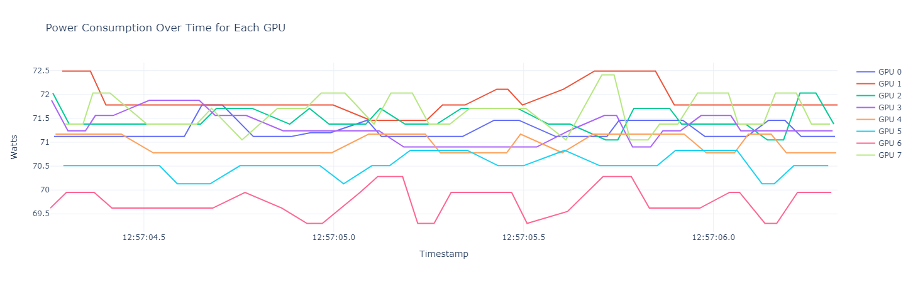

# Compile

Compile the C program by

```
make
```

# Fetch the instant power usage

```
time ./dcgm_test > result.csv
```

Note: make sure you have DCGM running `systemctl status nvidia-dcgm`

# Plot the data

```
python myplot.py result.csv result.png
```

It generates the figure `result.png`

Or you can directly execut and view it from the plot.ipynb


# Issues

Looks like the highest resolution of `DCGM_FI_DEV_POWER_USAGE_INSTANT` is 50 milliseconds, even if `loopIntervalUsec` were set to 1 millesecond.
For example, approximately 42 samples can be captured in 2 seconds.


